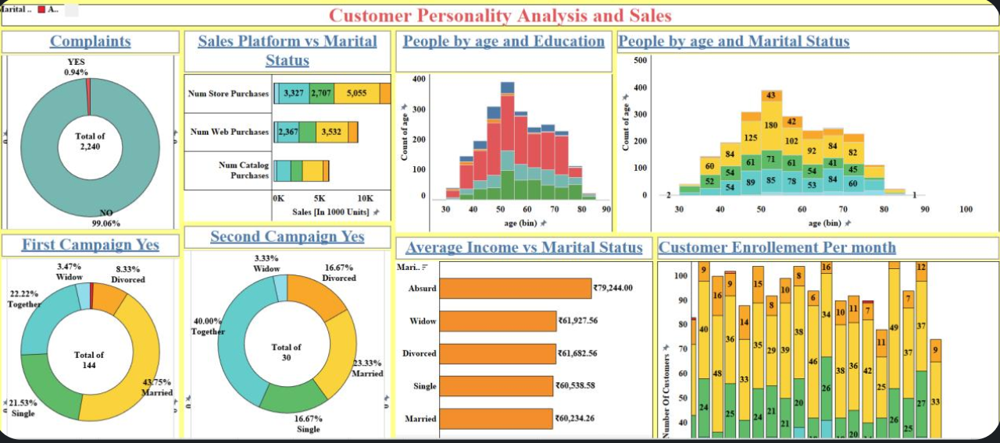

# Customer Personality Analysis on Tableau

This project focuses on visualizing and interpreting customer behavior using Tableau dashboards, derived from structured customer data. It provides actionable business insights that enhance customer targeting, optimize marketing strategies, and improve sales outcomes.

## Project Overview

By analyzing key customer attributes—such as age, education, marital status, income, and purchase behavior—this project delivers a clear picture of customer segmentation and interaction patterns with marketing campaigns and platforms.

> **Visualization Tool**: Tableau  
> **Dataset Size**: 2,240 customers  
> **Data Source**: Cleaned and anonymized marketing dataset  
> **Repository Link**: [View Dashboard](https://github.com/Ishaan2005/Customer-Personality-Analysis-on-Tableau)

---

## Key Performance Indicators (KPIs)

- **Customer Complaint Rate**
  - Only 0.94% of customers raised complaints, indicating high satisfaction or low feedback engagement.
  
- **Sales Channel Performance**
  - Store purchases lead in volume, followed by web and catalog channels. Platform usage varies with marital status.

- **Campaign Effectiveness**
  - First campaign had a better reach compared to the second, especially among married customers.

- **Income Segmentation**
  - Average income varies across marital status groups:
    - Widowed: ₹61,927.56  
    - Married: ₹60,234.26  
    - Divorced: ₹61,682.56  
    - Single: ₹60,538.58  
    - Outlier group ("Absurd"): ₹79,244.00

- **Enrollment Trends**
  - Highest enrollment rates observed in mid-year months; seasonal spikes indicate effective promotional periods.

- **Demographic Patterns**
  - Age distribution peaks between 40–60 years.  
  - Strong correlation between age, education, and marital status in influencing sales behavior.

---

## Dashboard Insights

| Section | Key Findings |
|--------|--------------|
| **Complaints** | Over 99% of customers have not filed complaints. |
| **Sales vs Marital Status** | Married customers lead store and web purchases. |
| **Age vs Education** | Customers aged 40–60 with higher education are more active. |
| **Campaign Results** | Married customers respond most to marketing campaigns. |
| **Customer Enrollment** | Enrollments are highest around July–September. |
| **Income Analysis** | Income segmentation reveals potential for tiered pricing strategies. |

---

## Business Impact

- **Optimize Platform Strategies**: Focus more on store and web channels, tailoring promotions to high-performing demographics.
- **Targeted Campaigning**: Prioritize married and middle-aged groups for better marketing ROI.
- **Refine Service Quality**: While complaints are low, further improvements can be made using proactive feedback mechanisms.
- **Seasonal Planning**: Align marketing pushes with high-engagement months to maximize acquisition.

---

## Getting Started

This project is designed for business analysts, marketing strategists, and data enthusiasts aiming to turn raw customer data into strategic advantage.

### To View the Dashboard:
1. Open Tableau or Tableau Public.
2. Download the `.twbx` file from the repository (if available).
3. Explore each dashboard section interactively.

